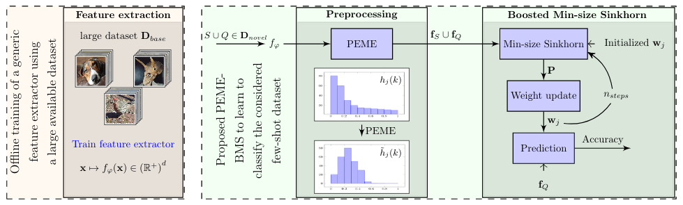

# Squeezing Backbone Feature Distributions to the Max for Efficient Few-Shot Learning

This repository is the official implementation of [Squeezing Backbone Feature Distributions to the Max for Efficient Few-Shot Learning](https://arxiv.org/pdf/2110.09446.pdf).



## Requirements

To install requirements:

```setup
pip install -r requirements.txt
```

## Pre-trained Models

You can download the extracted features here:

- [Extracted novel class features](https://drive.google.com/file/d/1dSKfO0mMz0KzObXIU930JFbhb7OK1qUU/view?usp=sharing) on miniImageNet, tieredImagenet, cub and cifar-fs . 

- Create a 'checkpoint' folder 
- Untar the downloaded file and move it into the 'checkpoint' folder.


## Boosted Min-size Sinkhorn


> 📋 To launch the BMS algorithm, run:
```
python test_standard_bms.py --dataset [mini/tiered/cub/cifar-fs] --model wrn --method [BMS/BMS_] --preprocess PEME --shot [1/5] --epoch [0/20/40] 
```

## Results

Our model achieves the following performance on :


| Dataset        | 1-shot Accuracy  | 5-shot Accuracy |
| ---------------|---------------| -------------|
| miniImageNet   |  83.35+-0.25% | 89.53+-0.13% |
| tieredImageNet |  86.07+-0.25% | 91.09+-0.14% |
| CUB            |  91.91+-0.18% | 94.62+-0.09% |
| CIFAR-FS       |  87.83+-0.22% | 91.20+-0.15% |

## References

[Leveraing the Feature Distribution in Transfer-based Few-Shot Learning](https://arxiv.org/pdf/2006.03806.pdf)

[Sinkhorn Distances: Lightspeed Computation of Optimal Transport](https://papers.nips.cc/paper/4927-sinkhorn-distances-lightspeed-computation-of-optimal-transport.pdf)

[SimpleShot: Revisiting Nearest-Neighbor Classification for Few-Shot Learning](https://arxiv.org/pdf/1911.04623.pdf)

[Notes on optimal transport](https://github.com/MichielStock/Teaching/tree/master/Optimal_transport)
